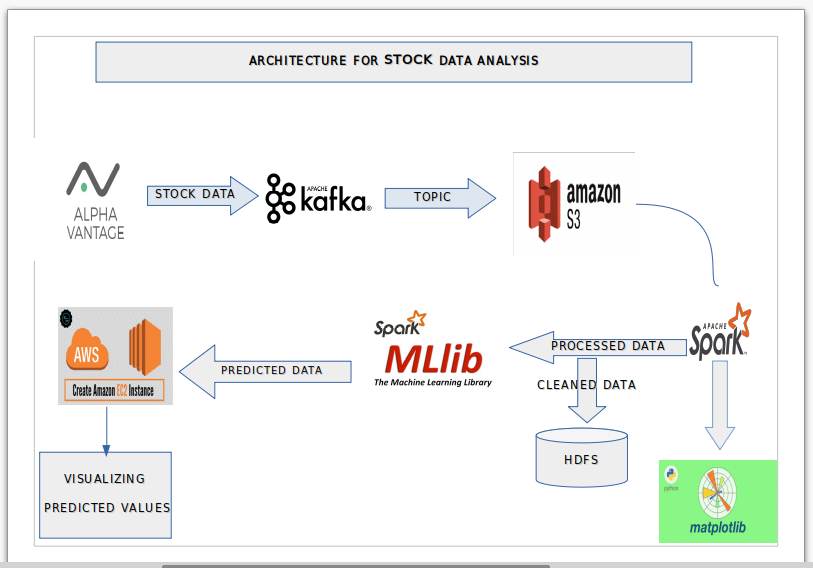
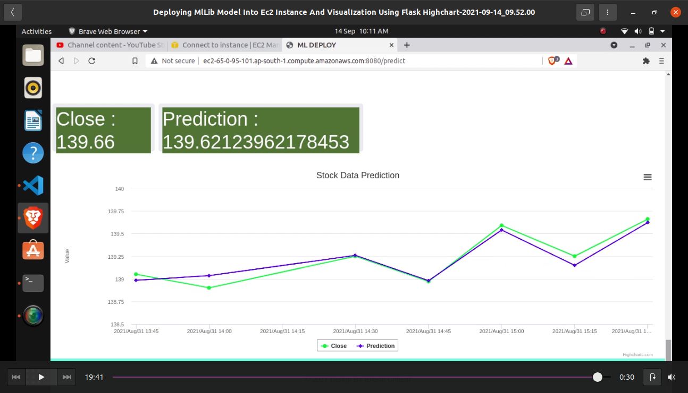

# Stock Data Prediction Using Live Data

## PROJECT SIMULATION ON STOCK PRICE PREDICTION USING LIVE DATA

### Prerequisites:-

* Hadoop 3.3.1
* Kafka 2.13
* Spark 3.1.2
* MLlib
* AWS EC2
* AWS S3
* Python 3.8
* Java

### Library Used:

* Alpha_Vantage Api: for getting  stock data.
* Flask: for rendering visualization of data in web browser
* Following is the workflow diagram or architecture for our project for predicting the stock price

  
  

#### Start zookeeper services
* $ bin/zookeeper-server-start.sh config/zookeeper.properties

#### Start kafka services 
* $  bin/kafka-server-start.sh config/server.properties

#### Now  run the producer.py file for starting publishing messages.

#### Now finally we will run our app.py file :

#### After running the code we will see animated graph plotting data

  
  

